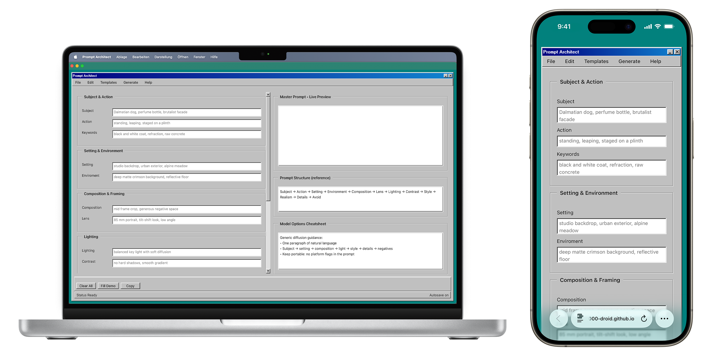

# Promt-Architect

  

Prompt Architect is a fully interactive, web-based tool designed to make prompt engineering tangible, visual, and systematic. Built in a Windows 98–inspired interface, it reimagines creative AI workflows through the logic of early computing, drawing on the structural clarity and interaction patterns of the 98.css open-source framework, where clarity, modularity, and structure define both form and function.

At its core, Prompt Architect serves as a modular master prompt builder for generative systems such as Midjourney, Stable Diffusion, Flux, and ChatGPT Images. Rather than writing prompts line by line, users construct them from discrete modules. Each field contributes to a coherent, human-readable prompt that balances linguistic precision with creative flexibility. The result is a cross-platform, diffusion-ready prompt built through design thinking rather than trial and error.

The interface merges retro visual identity with modern AI logic. Dropdown menus, windows, and contextual guides emulate a classic desktop environment while retaining full browser interactivity. Behind the nostalgic surface lies a dynamic JavaScript core that generates structured, plain-English prompts in real time. Tooltips and structural references help users understand how visual composition, linguistic tone, and aesthetic detail interact within AI image generation.

The development process integrated a combination of open-model reasoning systems and retro-inspired interface frameworks. The project draws from Google’s Gemma family and GPT-OSS architectures for linguistic patterning, alongside community-distilled Claude-style models for refinement, structure, and reasoning flow.

Technically, the app is lightweight and self-contained, fully client-side, requiring no backend or API keys. It runs in any modern browser, preserving accessibility and user privacy.

Prompt Architect stands as a bridge between nostalgia and innovation, a digital studio where design sensibility meets machine intelligence. It invites users to slow down, observe the anatomy of prompts, and treat AI image generation not as an algorithmic black box, but as a medium shaped by words, structure, and intention.

**Live Demo:** [**Prompt Architect**](https://emircanyilmaz2000-droid.github.io/Promt-Architect/)

# Academic Context

This tool was created as part of a university course project at the Faculty of Design, Darmstadt University of Applied Sciences.
It emerged within the collective research framework
“It worked right away with ChatGPT”,
a design toolkit and experiment exploring how AI and vibe coding can expand creative possibilities, without relying on proprietary, closed models.

Developed by students at Darmstadt University of Applied Sciences — Faculty of Design, the project proves that open language models can empower designers and enable new approaches to creative practice.
It’s a call to use AI not just for convenience, but consciously, as a tool for reflection, experimentation, and design intelligence.

Part of the collective research project [**It worked right away with ChatGPT — Faculty of Design, h_da**](https://felixdoelker.de/it_worked_right_away_with_chatgpt/)

